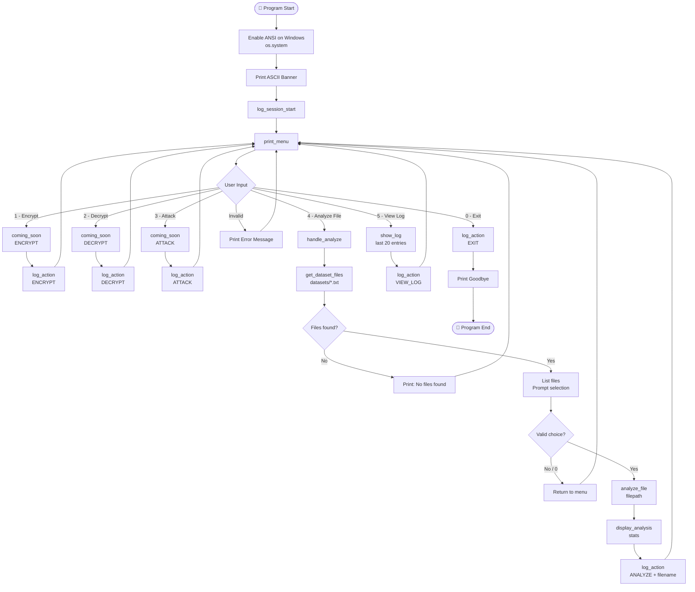

# 🔐 CryptoLabX — Cryptography Laboratory Toolkit

> **Course:** Cryptography Laboratory (22CPP307)
> **Group:** 01 | **Lab Assignment:** 1 — Python Foundations for Cryptography

---

## 👥 Group Members

| Name | Roll Number | GitHub |
|------|-------------|--------|
| Nishant | 2024UCP1773 | [@Nishant-3005](https://github.com/Nishant-3005) |
| Lokesh Saini | 2024UCP1505 | [@lokesh2804-maker](https://github.com/lokesh2804-maker) |

---

## 📌 Project Overview

**CryptoLabX** is a Python-based command-line toolkit developed as part of the Cryptography Laboratory course (22CPP307). The project builds a structured, extensible foundation for exploring classical and modern cryptographic algorithms throughout the semester.

---

## ✅ What Was Done in Lab 1

### 1. Project Setup & Repository Initialization
- Created and structured a Python project repository on GitHub (`CryptoLabX_Group01`)
- Established a clean directory layout: `main.py`, `utils/`, `datasets/`, `resources/`, `outputs/`
- Configured `.gitignore` to exclude compiled files, virtual environments, log outputs, and OS-specific metadata
- Both collaborators linked to the shared remote repository

### 2. Dataset Preparation
- Populated the `datasets/` directory with **5 plain-text sample files** (`data1.txt` – `data5.txt`)
- These files serve as input corpus for frequency analysis and future cipher experiments
- All files are plain UTF-8 encoded text

### 3. Menu-Driven CLI Interface (`main.py`)

The entry point of the toolkit. It provides a coloured, interactive terminal experience using **ANSI escape codes** and a structured main loop.

**Key components:**

- **Imports:** `os`, `glob` for filesystem operations; `utils.file_analysis` and `utils.logger` for modular functionality
- **ANSI Colours:** Escape sequences defined for cyan, green, yellow, red, magenta, bold, and reset — used throughout for a polished terminal UI
- **ASCII Banner:** A decorative `_BANNER_ART` banner displayed at startup, wrapped in cyan + bold formatting
- **`print_menu()`:** Renders the main menu with colour-coded options (Encrypt, Decrypt, Attack, Analyze File, View Log, Exit)
- **`main()` loop:** Enables ANSI on Windows, prints the banner, starts a session log, then runs an infinite loop reading user input and dispatching to the appropriate handler

**Menu Options:**

| Option | Feature | Status |
|--------|---------|--------|
| `[1]` | Encrypt | 🔜 Coming Soon |
| `[2]` | Decrypt | 🔜 Coming Soon |
| `[3]` | Attack (Cryptanalysis) | 🔜 Coming Soon |
| `[4]` | Analyze File | ✅ Implemented |
| `[5]` | View Session Log | ✅ Implemented |
| `[0]` | Exit | ✅ Implemented |

### 4. File Analysis Module (`utils/file_analysis.py`)

Implements the **Task 4** requirement: read a text file and compute statistical information useful for frequency analysis attacks.

- **`analyze_file(filepath)`** — Returns a dict with:
  - Total characters (including whitespace & punctuation)
  - Total words and total lines
  - Unique character set across the file
  - Letter frequency counts (A–Z, case-insensitive) via `collections.Counter`
- **`display_analysis(stats)`** — Pretty-prints a formatted report to the terminal including a **Top-10 letter frequency bar chart** with percentage breakdown rendered using `#` bars

- **`get_dataset_files()`** — Finds all `.txt` files in `datasets/` via `glob.glob`, returns a sorted list
- **`handle_analyze()`** — Lists available files, prompts user selection, validates input, calls `analyze_file` + `display_analysis`, logs the action, and handles `FileNotFoundError` gracefully

This module forms the foundation for **frequency analysis attacks** on classical ciphers (e.g., Caesar, Vigenère) in upcoming labs.

### 5. Session Logger (`utils/logger.py`)

Implements the **Task 5** requirement: maintain a persistent, timestamped log of all user actions.

- Auto-creates the `outputs/` directory and `cryptolabx.log` file on first run
- **`log_session_start()`** — Writes a session separator (`SESSION STARTED [timestamp]`) when the program launches
- **`log_action(action, detail="")`** — Appends a timestamped entry for every menu action
- **`show_log()`** — Displays the last 20 log entries in the terminal (triggered by menu option `[5]`)

Log format:
```
[YYYY-MM-DD HH:MM:SS]  ACTION: <action>  |  DETAIL: <optional detail>
```

### 6. Coming-Soon Placeholder (`coming_soon()`)
- Displays a formatted placeholder box for unimplemented features (Encrypt, Decrypt, Attack)
- Logs the attempted action so user behaviour is still tracked even for unimplemented features

---

## 🔁 CLI Flow Diagram

The diagram below shows the full lifecycle of the menu-driven main loop — from startup through each menu choice to exit:



---

## 🔑 Key Design Choices

| Principle | Implementation |
|-----------|----------------|
| **Modularity** | File analysis and logging separated into `utils/` package |
| **User-friendliness** | Coloured output via ANSI, ASCII banner, clear menus |
| **Error Handling** | Graceful handling of invalid input and missing files |
| **Extensibility** | Placeholder stubs for Encrypt / Decrypt / Attack modules |
| **Traceability** | Every user action is timestamped and persisted in a log file |
| **Educational** | Demonstrates CLI design, modularity, logging, and file I/O in Python |

---

## ✅ Lab2 Work (upcoming)

---

## 📁 Project Structure

```
CryptoLabX_Group01/
│
├── main.py                  # Entry point — CLI menu & main loop
│
├── utils/
│   ├── __init__.py          # Package initializer
│   ├── file_analysis.py     # Task 4: Text statistics & letter frequency
│   └── logger.py            # Task 5: Timestamped action logger
│
├── datasets/
│   ├── data1.txt            # Sample plaintext corpus (5 files)
│   ├── data2.txt
│   ├── data3.txt
│   ├── data4.txt
│   └── data5.txt
│
├── resources/               # Lab assignment PDFs & reference material
├── outputs/                 # Auto-generated: cryptolabx.log (gitignored)
├── requirements.txt         # Dependency list (stdlib only for Lab 1)
├── .gitignore               # Git exclusions
└── README.md                # This file
```

---

## 🚀 Getting Started

### Prerequisites
- Python **3.10+** (uses `list[str]` type hints)
- No external packages needed — uses Python standard library only (`os`, `glob`, `collections`, `datetime`)

### Run the Toolkit

```bash
# Clone the repository
git clone https://github.com/Nishant-3005/CryptoLabX_Group01.git
cd CryptoLabX_Group01

# Run the CLI
python main.py
```

---

## 📦 Dependencies

| Package | Purpose | Status |
|---------|---------|--------|
| `os`, `glob`, `collections`, `datetime` | Core stdlib used in Lab 1 | ✅ In use |
| `numpy` ≥ 1.26.0 | Matrix operations for modern ciphers | 🔜 Planned |
| `sympy` ≥ 1.12 | Number theory, modular arithmetic | 🔜 Planned |
| `pycryptodome` ≥ 3.20.0 | Reference AES/RSA implementations | 🔜 Planned |
| `matplotlib` ≥ 3.8.0 | Frequency analysis plots | 🔜 Planned |

---

## 🔭 Upcoming (Future Labs)

- [ ] **Caesar Cipher** — Encrypt / Decrypt / Brute-force attack
- [ ] **Vigenère Cipher** — Polyalphabetic encryption & Kasiski attack
- [ ] **Rail Fence & Columnar Transposition** ciphers
- [ ] **Frequency Analysis** — Visual plots using matplotlib
- [ ] **Modular Arithmetic Utilities** — GCD, extended Euclidean, modular inverse
- [ ] **AES / RSA** — Modern cipher reference via pycryptodome

---

## 📝 Lab Progress

| Lab | Tasks Completed | Status |
|-----|----------------|--------|
| Lab 1 | Project init, datasets, CLI menu, file analysis, logger | ✅ Done |
| Lab 2 | Caesar & Vigenère cipher implementation | 🔜 Upcoming |
| Lab 3 | Cryptanalysis / attack modules | 🔜 Upcoming |

---

*CryptoLabX — Group 01 | 22CPP307 Cryptography Laboratory | MNIT Jaipur*
