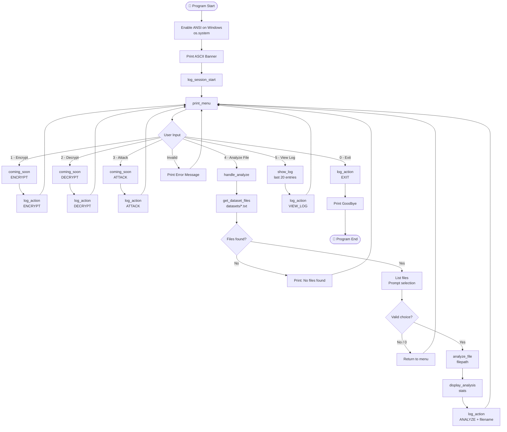

# 🔐 CryptoLabX — Cryptography Laboratory Toolkit

> **Course:** Cryptography Laboratory (22CPP307)
> **Group:** 01 | Labs 1–5 — Python Foundations · SAST · ATM System · Shift Cipher Attack · Monoalphabetic Substitution Attack

---

## 👥 Group Members

| Name | Roll Number | GitHub |
|------|-------------|--------|
| Nishant | 2024UCP1773 | [@Nishant-3005](https://github.com/Nishant-3005) |
| Lokesh Saini | 2024UCP1505 | [@lokesh2804-maker](https://github.com/lokesh2804-maker) |

---

## 📌 Project Overview

**CryptoLabX** is a Python-based command-line toolkit developed as part of the Cryptography Laboratory course (22CPP307). The project builds a structured, extensible foundation for exploring classical and modern cryptographic algorithms throughout the semester.

---

## ✅ What Was Done in Lab 1

### 1. Project Setup & Repository Initialization
- Created and structured a Python project repository on GitHub (`CryptoLabX_Group01`)
- Established a clean directory layout: `main.py`, `utils/`, `datasets/`, `resources/`, `outputs/`
- Configured `.gitignore` to exclude compiled files, virtual environments, log outputs, and OS-specific metadata
- Both collaborators linked to the shared remote repository

### 2. Dataset Preparation
- Populated the `datasets/` directory with **5 plain-text sample files** (`data1.txt` – `data5.txt`)
- These files serve as input corpus for frequency analysis and future cipher experiments
- All files are plain UTF-8 encoded text

### 3. Menu-Driven CLI Interface (`main.py`)

The entry point of the toolkit. It provides a coloured, interactive terminal experience using **ANSI escape codes** and a structured main loop.

**Key components:**

- **Imports:** `os`, `glob` for filesystem operations; `utils.file_analysis` and `utils.logger` for modular functionality
- **ANSI Colours:** Escape sequences defined for cyan, green, yellow, red, magenta, bold, and reset — used throughout for a polished terminal UI
- **ASCII Banner:** A decorative `_BANNER_ART` banner displayed at startup, wrapped in cyan + bold formatting
- **`print_menu()`:** Renders the main menu with colour-coded options (Encrypt, Decrypt, Attack, Analyze File, View Log, Exit)
- **`main()` loop:** Enables ANSI on Windows, prints the banner, starts a session log, then runs an infinite loop reading user input and dispatching to the appropriate handler

**Menu Options:**

| Option | Feature | Status |
|--------|---------|--------|
| `[1]` | Encrypt | 🔜 Coming Soon |
| `[2]` | Decrypt | 🔜 Coming Soon |
| `[3]` | Attack (Cryptanalysis) | 🔜 Coming Soon |
| `[4]` | Analyze File | ✅ Implemented |
| `[5]` | View Session Log | ✅ Implemented |
| `[0]` | Exit | ✅ Implemented |

### 4. File Analysis Module (`utils/file_analysis.py`)

Implements the **Task 4** requirement: read a text file and compute statistical information useful for frequency analysis attacks.

- **`analyze_file(filepath)`** — Returns a dict with:
  - Total characters (including whitespace & punctuation)
  - Total words and total lines
  - Unique character set across the file
  - Letter frequency counts (A–Z, case-insensitive) via `collections.Counter`
- **`display_analysis(stats)`** — Pretty-prints a formatted report to the terminal including a **Top-10 letter frequency bar chart** with percentage breakdown rendered using `#` bars

- **`get_dataset_files()`** — Finds all `.txt` files in `datasets/` via `glob.glob`, returns a sorted list
- **`handle_analyze()`** — Lists available files, prompts user selection, validates input, calls `analyze_file` + `display_analysis`, logs the action, and handles `FileNotFoundError` gracefully

This module forms the foundation for **frequency analysis attacks** on classical ciphers (e.g., Caesar, Vigenère) in upcoming labs.

### 5. Session Logger (`utils/logger.py`)

Implements the **Task 5** requirement: maintain a persistent, timestamped log of all user actions.

- Auto-creates the `outputs/` directory and `cryptolabx.log` file on first run
- **`log_session_start()`** — Writes a session separator (`SESSION STARTED [timestamp]`) when the program launches
- **`log_action(action, detail="")`** — Appends a timestamped entry for every menu action
- **`show_log()`** — Displays the last 20 log entries in the terminal (triggered by menu option `[5]`)

Log format:
```
[YYYY-MM-DD HH:MM:SS]  ACTION: <action>  |  DETAIL: <optional detail>
```

### 6. Coming-Soon Placeholder (`coming_soon()`)
- Displays a formatted placeholder box for unimplemented features (Encrypt, Decrypt, Attack)
- Logs the attempted action so user behaviour is still tracked even for unimplemented features

---

## 🔁 CLI Flow Diagram

The diagram below shows the full lifecycle of the menu-driven main loop — from startup through each menu choice to exit:


```mermaid
flowchart TD
    A([🚀 Program Start]) --> B[Enable ANSI on Windows\nos.system]
    B --> C[Print ASCII Banner]
    C --> D[log_session_start]
    D --> E[print_menu]

    E --> F{User Input}

    F -->|1 - Encrypt| G[coming_soon\nENCRYPT]
    G --> L1[log_action\nENCRYPT]
    L1 --> E

    F -->|2 - Decrypt| H[coming_soon\nDECRYPT]
    H --> L2[log_action\nDECRYPT]
    L2 --> E

    F -->|3 - Attack| I[coming_soon\nATTACK]
    I --> L3[log_action\nATTACK]
    L3 --> E

    F -->|4 - Analyze File| J[handle_analyze]
    J --> J1[get_dataset_files\ndatasets/*.txt]
    J1 --> J2{Files found?}
    J2 -->|No| J3[Print: No files found]
    J2 -->|Yes| J4[List files\nPrompt selection]
    J4 --> J5{Valid choice?}
    J5 -->|No / 0| J6[Return to menu]
    J5 -->|Yes| J7[analyze_file\nfilepath]
    J7 --> J8[display_analysis\nstats]
    J8 --> J9[log_action\nANALYZE + filename]
    J3 --> E
    J6 --> E
    J9 --> E

    F -->|5 - View Log| K[show_log\nlast 20 entries]
    K --> L4[log_action\nVIEW_LOG]
    L4 --> E

    F -->|0 - Exit| X[log_action\nEXIT]
    X --> Y[Print Goodbye]
    Y --> Z([🔴 Program End])

    F -->|Invalid| V[Print Error Message]
    V --> E
```

---

## 🔑 Key Design Choices

| Principle | Implementation |
|-----------|----------------|
| **Modularity** | File analysis and logging separated into `utils/` package |
| **User-friendliness** | Coloured output via ANSI, ASCII banner, clear menus |
| **Error Handling** | Graceful handling of invalid input and missing files |
| **Extensibility** | Placeholder stubs for Encrypt / Decrypt / Attack modules |
| **Traceability** | Every user action is timestamped and persisted in a log file |
| **Educational** | Demonstrates CLI design, modularity, logging, and file I/O in Python |

---

## ✅ Lab 2 — Static Application Security Testing (SAST)

### Overview
Lab 2 introduced **Static Application Security Testing** using [Bandit](https://bandit.readthedocs.io/), a Python SAST tool. The goal was to deliberately write insecure code, scan it with Bandit, and document findings with remediation strategies.

### Work Done

| File | Description |
|---|---|
| `Lab2_SAST_Bandit/insecure.py` | Intentionally vulnerable Python program demonstrating 9 common security flaws |
| `Lab2_SAST_Bandit/bandit_report.txt` | Raw Bandit scan output (10 issues: 3 High, 2 Medium, 5 Low) |
| `Lab2_SAST_Bandit/bandit_analysis_report.md` | Detailed analysis of every finding with exploit explanation and secure fix |
| `Lab2_SAST_Bandit/installation_record.md` | Bandit installation procedure, OS info, version, and dependencies |
| `Lab2_SAST_Bandit/sast_lab_log.txt` | Full terminal session log of the lab |
| `Lab2_SAST_Bandit/command_history.txt` | Command history for reproducibility |

### Vulnerabilities Found in `insecure.py`

| Bandit ID | Severity | Issue |
|---|---|---|
| B602 | **High** | `subprocess.call()` with `shell=True` — OS command injection |
| B322 | **High** | `input()` feeding shell command |
| B322 | **High** | `input()` feeding `pickle.loads()` |
| B303 | Medium | MD5 used for hashing (cryptographically broken) |
| B301 | Medium | `pickle.loads()` on untrusted user data — RCE risk |
| B404 | Low | Import of `subprocess` module |
| B403 | Low | Import of `pickle` module |
| B311 | Low | `random.random()` used (not cryptographically secure) |
| B605/B607 | Low | `os.system()` with shell + partial path |

### Key Takeaways
- Never use `shell=True` with user-controlled input
- `pickle` should never deserialize untrusted data
- MD5/SHA1 are broken — use SHA-256 or above
- Use Python's `secrets` module (not `random`) for cryptographic values

---

## ✅ Lab 3 — Vulnerable Application Development: ATM System

### Overview
Lab 3 extends the SAST methodology from Lab 2 by going one step further: instead of scanning a single insecure script, we **designed and built a complete modular application** with deliberate vulnerabilities, then scanned, documented, and analysed the results.

**Application:** ATM System (Group 1, assigned by Group No. % 10)  
**Architecture:** 4 modules (`atm.py`, `auth.py`, `account.py`, `database.py`)  
**Run:** `py -3 Secure_Application/src/atm.py`

### Core Functionalities Implemented

| # | Feature | Module |
|---|---|---|
| 1 | Login (account + PIN) | `auth.py` → `login()` |
| 2 | Balance Inquiry | `account.py` → `balance_inquiry()` |
| 3 | Cash Withdrawal | `account.py` → `withdraw()` |
| 4 | Cash Deposit | `account.py` → `deposit()` |
| 5 | PIN Change | `auth.py` → `change_pin()` |

### Deliberate Vulnerabilities

| # | Vulnerability | CWE | Bandit Rule | Demo |
|---|---|---|---|---|
| VULN-1 | **Hardcoded credentials** — PINs & admin password in source | CWE-259 | B105 | Open `database.py`, read PINs directly |
| VULN-1b | **MD5 used for PIN hashing** — cryptographically broken | CWE-327 | B324 (High) | Bandit flags 2 High severity issues |
| VULN-2 | **Improper input validation** — negative withdrawal increases balance | CWE-20 | Logic flaw | Enter `-500` at withdrawal prompt |
| VULN-3 | **Information leakage** — full tracebacks & PIN echoed to screen | CWE-209 | Logic flaw | Enter `0000000000` at login |

### Bandit Scan Results

```
Total: 6 issues | 2 High | 0 Medium | 4 Low
```

| Rule | Severity | Location | Issue |
|---|---|---|---|
| B324 | **High** | `database.py:35,41` | `hashlib.md5()` for PIN verification |
| B105 | Low | `database.py:26,27` | Hardcoded password/secret strings |
| B605/B607 | Low | `atm.py:40` | `os.system("")` for ANSI on Windows |

### Key Takeaway
SAST tools (Bandit) detect **pattern-based** vulnerabilities (hardcoded strings, weak hashes) but **cannot detect logic flaws** like VULN-2 and VULN-3. Manual code review remains essential.

---

## ✅ Lab 4 — Shift Cipher Cryptanalysis

### Overview
Lab 4 implemented **two automated cryptanalysis attacks** against the classical Shift (Caesar) Cipher — which has only 26 possible keys — using a brute-force approach scored by English language evidence.

**Folder:** `attacks/shift_cipher_attack/`

### Attacks Implemented

| Attack | File | How it Works |
|--------|------|--------------|
| **Brute-Force + Dictionary Scoring** | `brute_force_dictionary.py` | Tries all 26 keys; counts real English words in each decryption; highest word-match count = predicted key |
| **Chi-Square Statistical Analysis** | `chi_square_attack.py` | Tries all 26 keys; computes χ² distance between observed letter frequencies and English reference; lowest χ² = predicted key |
| **Shift Cipher Core** | `shift_cipher.py` | `encrypt(pt, key)` and `decrypt(ct, key)` using formula C = (P + k) mod 26 |
| **Unified Runner** | `main.py` | Runs both attacks, compares results, interactive mode, outputs test results table |

### Key Results
- Both attacks correctly identified the key for long English texts (≥ 30 characters)
- Dictionary scoring outperforms Chi-Square on short texts with common words
- Chi-Square outperforms dictionary scoring on texts with proper nouns or unusual vocabulary
- A combined strategy (top-3 Chi-Square candidates validated by dictionary scoring) gave best results

### English Letter Frequency Used
```
E=12.7%  T=9.1%  A=8.2%  O=7.5%  I=7.0%  N=6.7%  S=6.3%  H=6.1%  R=6.0%  D=4.3%
```

---

## ✅ Lab 5 — Monoalphabetic Substitution Cipher Cryptanalysis

### Overview
Lab 5 implemented and then **broke** a Monoalphabetic Substitution Cipher — where each letter maps to a unique fixed replacement. With 26! ≈ 4×10²⁶ possible keys, brute force is computationally infeasible. Instead, three complementary attacks are applied in sequence.

**Folder:** `attacks/monosubstitution_cipher_attack/`  
**Source Text:** *Introduction to Modern Cryptography* — Katz & Lindell, Page 31 (Definition of Perfect Secrecy)

### Modules Implemented

| File | Functions | Purpose |
|------|-----------|--------|
| `monosubstitution_cipher.py` | `encrypt()`, `decrypt()`, `generate_random_key()` | Core cipher |
| `frequency_analysis.py` | `frequency_analysis()`, `word_frequency_analysis()`, `pattern_analysis()` | All 3 required analysis functions |
| `cryptanalysis.py` | `apply_substitution()`, `display_partial_plaintext()`, `verify_solution()` | Iterative key recovery |
| `main.py` | Full orchestrator | Interactive + auto-demo modes |

### Attack Pipeline

```
Step 1: frequency_analysis()       → rank CT letters; top = likely E, T, A...
Step 2: word_frequency_analysis()  → most frequent 3-letter word = "THE"
Step 3: pattern_analysis()         → match word patterns to English candidates
Step 4: apply_substitution()       → build partial key; display _ for unknowns
Step 5: verify_solution()          → re-encrypt and confirm exact match
```

### Experimental Results (Katz & Lindell Page 31)

| Step | Observation | Substitution | Outcome |
|------|------------|--------------|--------|
| 1 | CT letter `O` most frequent (12.9%) | O → E | Accepted |
| 2 | CT word `EIO` appears 89 times | EIO → THE | Accepted — 3 letters fixed |
| 3 | CT word `EB` appears 47 times | EB → TO | Accepted — 2 more letters |
| 4 | CT word `TKL` appears 31 times | TKL → AND | Accepted — 3 more letters |
| 5–11 | Context clues from partial text | Remaining 18 letters filled iteratively | All 26 resolved |
| 12 | `verify_solution()` called | Re-encrypt recovered PT | **EXACT MATCH — VERIFIED** |

### Key Limitation Demonstrated
Bandit/SAST-style tools detect API misuse. But the fundamental weakness here is **statistical** — the cipher preserves letter frequency, making it transparent to frequency analysis regardless of key size.

---

## 📁 Project Structure

```
CryptoLabX_Group01/
│
├── main.py                        # Lab 1: CLI entry point & main loop
│
├── utils/
│   ├── __init__.py                # Package initializer
│   ├── file_analysis.py           # Text statistics & letter frequency
│   └── logger.py                  # Timestamped action logger
│
├── datasets/
│   ├── data1.txt                  # Sample plaintext corpus (5 files)
│   ├── data2.txt
│   ├── data3.txt
│   ├── data4.txt
│   └── data5.txt
│
├── Lab2_SAST_Bandit/              # Lab 2: SAST work (Bandit on insecure.py)
│   ├── insecure.py                # Deliberately vulnerable test program
│   ├── bandit_report.txt          # Raw Bandit scan output
│   ├── bandit_analysis_report.md  # Detailed findings + remediation
│   ├── installation_record.md     # Bandit setup procedure
│   ├── sast_lab_log.txt           # Full terminal session log
│   └── command_history.txt        # Commands for reproducibility
│
├── Secure_Application/            # Lab 3: ATM System (vulnerable app)
│   ├── README.md                  # Folder-level documentation
│   ├── src/
│   │   ├── atm.py             # Entry point & menu loop
│   │   ├── auth.py            # Login & PIN change
│   │   ├── account.py         # Balance, withdraw, deposit
│   │   └── database.py        # In-memory account store
│   ├── sast/
│   │   └── bandit_report_lab3.txt  # Bandit scan output
│   ├── reports/               # Analysis reports (add here)
│   └── screenshots/           # Demo screenshots (add here)
│
├── classical/                     # Future: Caesar, Vigenère ciphers
├── modern/                        # Future: AES, RSA
├── attacks/                       # Cryptanalysis implementations
│   ├── shift_cipher_attack/       # Lab 4: Brute-force + Chi-Square on Caesar cipher
│   │   ├── src/                   # shift_cipher.py, brute_force_dictionary.py, chi_square_attack.py, main.py
│   │   ├── dictionary/            # english_words.txt
│   │   ├── outputs/               # results.txt
│   │   └── reports/
│   └── monosubstitution_cipher_attack/  # Lab 5: Frequency + Pattern analysis attack
│       ├── src/                   # monosubstitution_cipher.py, frequency_analysis.py, cryptanalysis.py, main.py
│       ├── data/                  # plaintext_source.txt (Katz & Lindell page 31)
│       ├── outputs/               # results.txt
│       └── reports/               # Assignment_5_Report.md
├── analysis/                      # Future: Statistical tools
├── tests/                         # Future: Unit tests
├── docs/                          # Future: Lab reports & documentation
│
├── resources/                     # Assignment PDFs & reference docs (gitignored)
├── outputs/                       # Auto-generated: cryptolabx.log (gitignored)
├── requirements.txt               # Dependency list
├── .gitignore                     # Git exclusions
└── README.md                      # This file
```

---

## 🚀 Getting Started

### Prerequisites
- Python **3.10+** (uses `list[str]` type hints)
- No external packages needed — uses Python standard library only (`os`, `glob`, `collections`, `datetime`)

### Run the Toolkit

```bash
# Clone the repository
git clone https://github.com/Nishant-3005/CryptoLabX_Group01.git
cd CryptoLabX_Group01

# Run the CLI
python main.py
```

---

## 📦 Dependencies

| Package | Purpose | Status |
|---------|---------|--------|
| `os`, `glob`, `collections`, `datetime` | Core stdlib used in Lab 1 | ✅ In use |

---

## 📝 Lab Progress

| Lab | Tasks Completed | Status |
|-----|----------------|--------|
| Lab 1 | Project init, datasets, CLI menu, file analysis, logger | ✅ Done |
| Lab 2 | SAST with Bandit — insecure program, scan, analysis report, installation record | ✅ Done |
| Lab 3 | ATM System — modular Python app, 3 deliberate vulns, Bandit scan, SAST report | ✅ Done |
| Lab 4 | Shift Cipher Cryptanalysis — brute-force + dictionary scoring + Chi-Square analysis | ✅ Done |
| Lab 5 | Monoalphabetic Substitution — frequency analysis, word/pattern analysis, iterative key recovery | ✅ Done |

---

*CryptoLabX — Group 01 | 22CPP307 Cryptography Laboratory | MNIT Jaipur*
