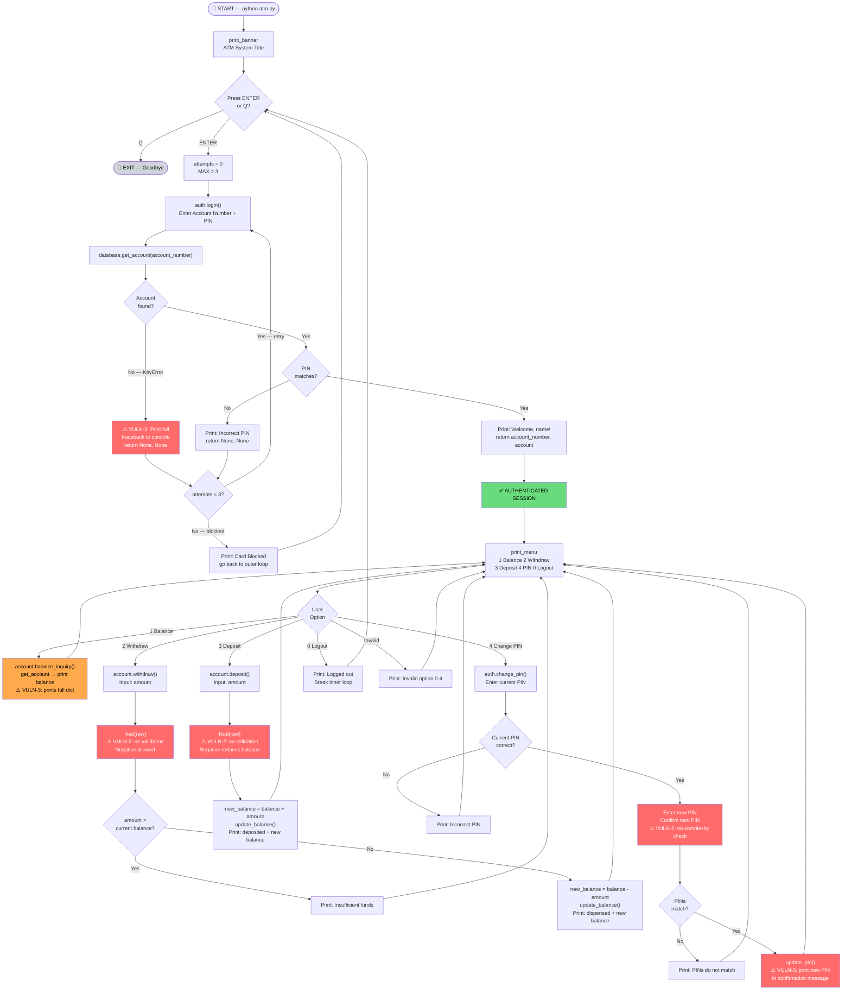

# Secure Application — Lab 3: ATM System
## CryptoLabX Group 01 | 22CPP307 Cryptography Laboratory

> **Assignment:** Lab 3 — Static Application Security Testing (SAST)  
> **Application:** ATM System (Group No. 1 % 10 = 1)  
> **SAST Tool:** Bandit  
> **Language:** Python 3

---

## What is this folder?

This folder contains all work for **Lab 3** of the Cryptography Laboratory course. The goal is to:

1. Build a **small, intentionally vulnerable Python application** (ATM System)
2. Run **Bandit** (SAST tool) to automatically detect security flaws
3. Document the findings and understand how to fix them

This is a **controlled learning exercise** — the vulnerabilities are deliberate and annotated in the source code.

---

## Folder Structure

```
Secure_Application/
│
├── src/                        Source code (Python modules)
│   ├── atm.py                  Entry point — main loop & menu
│   ├── auth.py                 Login & PIN change
│   ├── account.py              Balance, withdraw, deposit
│   └── database.py             In-memory account store
│
├── sast/                       SAST scan outputs
│   └── bandit_report_lab3.txt  Raw Bandit scan results
│
├── reports/                    Written analysis reports (add here)
│
└── screenshots/                Demo screenshots (add here)
```

---

## Quick Start

```bash
# From project root
py -3 Secure_Application/src/atm.py

# OR from inside src/
cd Secure_Application/src
py -3 atm.py
```

**Test credentials:**

| Account Number | PIN |
|---|---|
| `1001234567` | `1234` |
| `1009876543` | `4321` |

---

## Core Functionalities

| # | Feature | How to access |
|---|---|---|
| 1 | Login | At startup — enter account number + PIN |
| 2 | Balance Inquiry | Menu option `[1]` |
| 3 | Withdraw Cash | Menu option `[2]` |
| 4 | Deposit Cash | Menu option `[3]` |
| 5 | Change PIN | Menu option `[4]` |

---

## Deliberate Vulnerabilities

Three vulnerability categories are intentionally embedded for SAST demonstration:

### VULN-1 — Hardcoded Credentials (CWE-259)
- **Where:** `database.py` lines 26–27, 31, 38
- **What:** Account PINs and admin password stored directly in source code as string literals
- **Bandit rule:** B105 (`hardcoded_password_string`)
- **Demo:** Open `database.py` — you can read every PIN without running the program

### VULN-2 — Improper Input Validation (CWE-20)
- **Where:** `account.py` — `withdraw()` and `deposit()`
- **What:** No check for negative amounts, zero, or non-numeric input
- **Demo:** At withdrawal prompt, enter `-500` — your balance will *increase*

### VULN-3 — Information Leakage via Error Messages (CWE-209)
- **Where:** `auth.py` — `login()` exception handler; `auth.py` — `change_pin()` confirmation
- **What:** Full Python tracebacks printed to terminal on errors; new PIN echoed to screen
- **Demo:** At login, enter account number `0000000000` — a full stack trace appears

---

## Bandit Scan Results (Summary)

```
Total issues: 6
  High   : 2  (MD5 hash — B324)
  Medium : 0
  Low    : 4  (hardcoded passwords — B105; os.system — B605/B607)
```

Re-run the scan anytime:
```bash
py -3 -m bandit -r Secure_Application/src/
```

Full raw output: [`sast/bandit_report_lab3.txt`](sast/bandit_report_lab3.txt)  
Full technical explanation: [`resources/Lab3_ATM_Explanation.md`](../resources/Lab3_ATM_Explanation.md)

---

## Module Responsibility Map

```
atm.py          orchestrates everything
  └── calls → auth.login()
  └── calls → auth.change_pin()
  └── calls → account.balance_inquiry()
  └── calls → account.withdraw()
  └── calls → account.deposit()

auth.py         identity & credentials
  └── imports → database.get_account()
  └── imports → database.update_pin()

account.py      financial transactions
  └── imports → database.get_account()
  └── imports → database.update_balance()

database.py     data layer (no imports from other src files)
```

---

## Program Flow Diagram



> 🔴 **Red nodes** = deliberate vulnerability points (VULN-1/2/3)
> 🟠 **Orange node** = information leakage during normal operation
> 🟢 **Green node** = successful authentication checkpoint

---

*CryptoLabX Group 01 | Nishant (2024UCP1773) | Lokesh Saini (2024UCP1505) | 22CPP307 | MNIT Jaipur*
